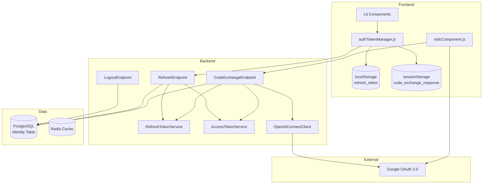
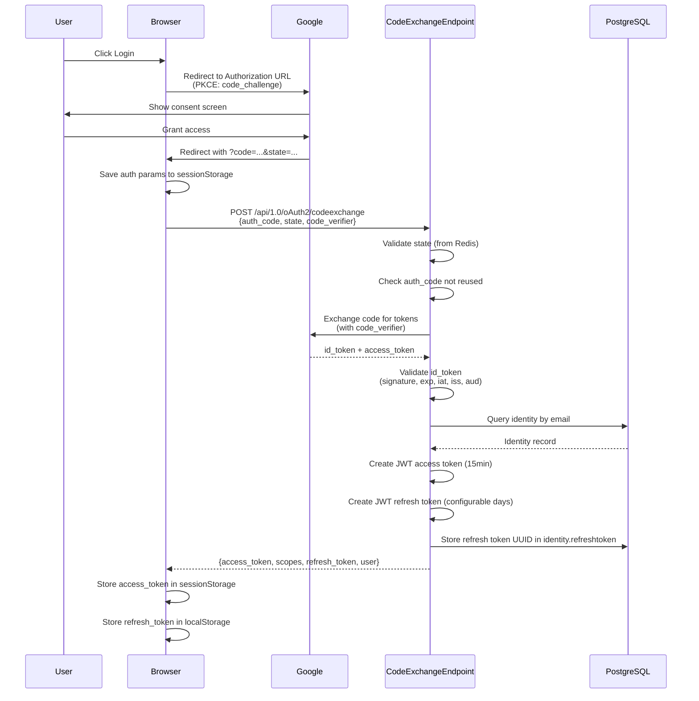
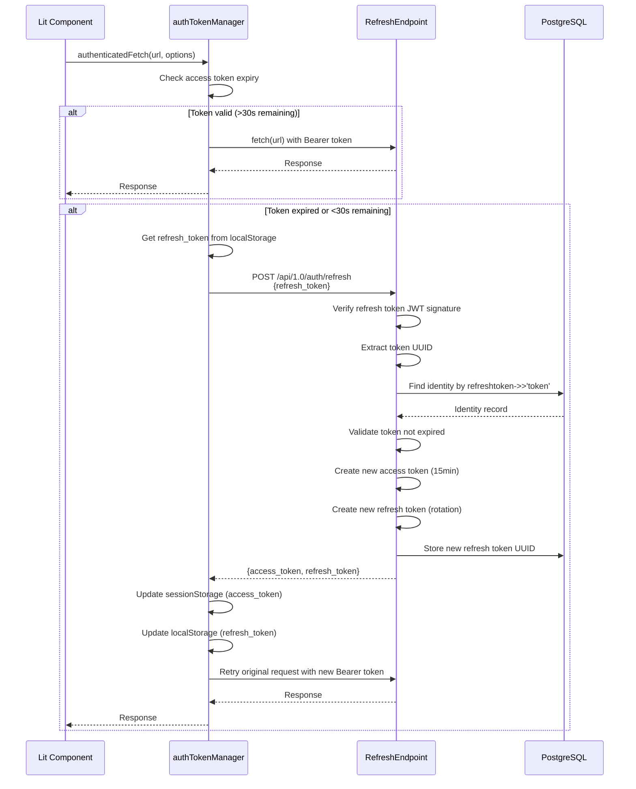
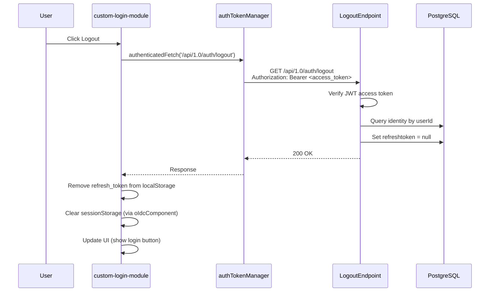
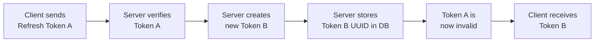

# Authentication System

## Overview

The application uses OpenID Connect (OIDC) with Google as the identity provider. Authentication is based on JWT access tokens (short-lived) and JWT refresh tokens (long-lived) with automatic token rotation.

## Architecture



## Authentication Flows

### Login Flow (Code Exchange)



### Automatic Token Refresh



### Logout Flow



### Token Rotation



Every refresh request invalidates the previous token and issues a new one. This limits the damage window if a refresh token is compromised.

## Token Specifications

| Property | Access Token | Refresh Token |
|----------|-------------|---------------|
| Format | JWT (HS256) | JWT (HS256) |
| Payload | userId, idp, scopes, iat, nbf, exp | token (UUID), issuedAt, expiresAt |
| Lifetime | 15 minutes (900s) | Configurable (AUTH_REFRESH_TOKEN_LIFETIME_DAYS) |
| Storage (Frontend) | sessionStorage | localStorage |
| Storage (Backend) | — | PostgreSQL (identity.refreshtoken JSONB) |
| Rotation | No | Yes (new token on each refresh) |
| Signing Secret | AUTH_SERVER_SECRET | AUTH_SERVER_SECRET |

## Database Schema

### Identity Table — refreshtoken Column

```sql
ALTER TABLE identity ADD COLUMN RefreshToken JSONB;
```

Stored value example:
```json
{
  "token": "2c448d2f-3452-4d96-8399-77b627b183bd",
  "issuedAt": "2026-05-24T11:30:17.854Z",
  "expiresAt": "2026-06-23T11:30:17.854Z"
}
```

The `token` field is the UUID used to identify which refresh token is valid. On logout, this column is set to `null`.

## Environment Variables

| Variable | Required | Description |
|----------|----------|-------------|
| `AUTH_SERVER_SECRET` | Yes | Secret for signing JWTs (access + refresh tokens) |
| `AUTH_REFRESH_TOKEN_LIFETIME_DAYS` | Yes | Refresh token lifetime in days |
| `AUTH_CLOCK_SKEW_SECONDS` | Yes | Allowed clock skew for ID token validation (seconds) |
| `GOOGLE_CLIENT_ID` | Yes | Google OAuth 2.0 Client ID |
| `GOOGLE_CLIENT_SECRET` | Yes | Google OAuth 2.0 Client Secret |
| `AUTH_OIDC_REDIRECT_URI` | Yes | OAuth callback redirect URI |

## API Endpoints

### POST /api/1.0/oAuth2/codeexchange

Exchanges an OAuth authorization code for access and refresh tokens.

**Request:**
```json
{
  "auth_code": "4/0AX4X...",
  "state": "random-state-string",
  "code_verifier": "pkce-verifier-string"
}
```

**Response (200):**
```json
{
  "authenticationResult": {
    "user": {
      "provider": "google",
      "first_name": "John",
      "last_name": "Doe",
      "picture": "https://...",
      "display_name": "John Doe",
      "email": "john@example.com"
    },
    "access": {
      "access_token": "eyJhbG...",
      "scopes": ["edit", "create", "delete"]
    },
    "refresh": {
      "refresh_token": "eyJhbG..."
    }
  }
}
```

### POST /api/1.0/auth/refresh

Refreshes an expired access token using a valid refresh token.

**Request:**
```json
{
  "refresh_token": "eyJhbG..."
}
```

**Response (200):**
```json
{
  "access_token": "eyJhbG...",
  "refresh_token": "eyJhbG..."
}
```

**Error Responses:**
- `400` — Missing refresh token
- `401` — Invalid, expired, or revoked refresh token
- `500` — Server configuration error

### GET /api/1.0/auth/logout

Invalidates the refresh token server-side and ends the session.

**Headers:** `Authorization: Bearer <access_token>`

**Response (200):** Empty (success)

**Error Responses:**
- `401` — Missing or invalid access token

## Frontend Module: authTokenManager

The `authTokenManager.js` module provides `authenticatedFetch` and `tryRestoreSession` — a drop-in replacement for `fetch()` that automatically handles token refresh and session restoration.

### Behavior

1. Before each request, checks if the access token is expired or within 30 seconds of expiry
2. If expired: calls the refresh endpoint, stores new tokens, then proceeds
3. Adds `Authorization: Bearer <token>` header automatically
4. Uses a shared promise to prevent parallel refresh requests from multiple components

### Usage

```javascript
import { authenticatedFetch } from '/modules/authTokenManager.js';

const response = await authenticatedFetch('/api/1.0/data/change/', {
  method: 'POST',
  headers: { 'Content-Type': 'application/json' },
  body: JSON.stringify(payload),
});
```

### Automatic Session Restoration on Startup

When the application starts, the `custom-login-module` component calls `tryRestoreSession()` to automatically re-establish a user session if a valid refresh token is stored in `localStorage`.

```javascript
import { tryRestoreSession } from '/modules/authTokenManager.js';

// Attempts to restore previous session using stored refresh token
const restored = await tryRestoreSession();
if (restored) {
  // Session restored successfully, update UI
}
```

The flow:
1. Checks if access token in sessionStorage is expired
2. If expired, retrieves refresh token from localStorage
3. Calls `/api/1.0/auth/refresh` with the refresh token
4. If successful, updates both sessionStorage (access token) and localStorage (new refresh token)
5. Returns `true` if session was restored, `false` otherwise

This allows users to remain logged in across browser sessions as long as the refresh token has not expired or been revoked.

## Frontend Module: custom-login-module

The `custom-login-module` component extends the login functionality by automatically attempting to restore the session on startup.

### Automatic Login

The component's `connectedCallback()` invokes `tryRestoreSession()`:

```javascript
async connectedCallback() {
  super.connectedCallback();
  addGlobalStylesToShadowRoot(this.shadowRoot);
  const restored = await tryRestoreSession();
  if (restored) {
    this.requestUpdate(); // Update UI to show logged-in state
  }
}
```

If a valid session is restored, the login button is hidden and the logout button is shown, giving the user a seamless experience without requiring manual re-authentication.

## Security Considerations

- **Token Rotation**: Each refresh invalidates the previous token, limiting exposure time
- **No Token Family Tracking**: If a stolen token is used, the legitimate user's next refresh will fail (tokens are single-use), but the attacker's session won't be automatically revoked
- **localStorage for Refresh Tokens**: Vulnerable to XSS attacks. Ensure Content Security Policy (CSP) headers are configured
- **Single Secret**: Both access and refresh tokens use the same `AUTH_SERVER_SECRET`. Rotating this secret invalidates all tokens
- **PKCE**: Authorization code flow uses PKCE (S256) to prevent code interception attacks
- **State Parameter**: Generated server-side and validated to prevent CSRF attacks

## File Structure

```
private/
├── modules/oAuth2/
│   ├── RefreshTokenService.js      # Token creation, verification, extraction
│   ├── AccessTokenService.js       # JWT access token creation
│   ├── JwtService.js               # Low-level JWT operations
│   └── OpenIdConnectClient.js      # OIDC protocol implementation
├── endpoints/api/1.0/auth/
│   ├── oAuth2/CodeExchangeEndpoint.js  # Login (code → tokens)
│   ├── RefreshEndpoint.js              # Token refresh with rotation
│   └── LogoutEndpoint.js              # Token invalidation
└── database2/tables/identity.js        # Identity table definition

public/
├── modules/
│   ├── authTokenManager.js         # Auto-refresh logic + authenticatedFetch
│   └── oIdcComponent.js            # OIDC UI component (login/logout buttons)
└── components/
    └── custom-login-module/        # Login UI with auth callback handling
```
